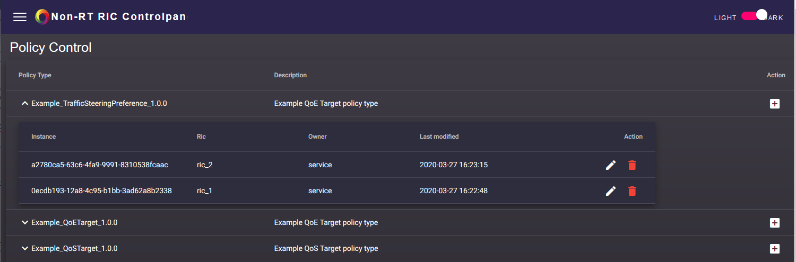

.. This work is licensed under a Creative Commons Attribution 4.0 International License.
.. SPDX-License-Identifier: CC-BY-4.0
.. Copyright (C) 2020 Nordix

Developer Guide
===============

This document provides a quickstart for developers of the Non-RT RIC Control Panel.

The Non-RT RIC Control Panel is an interface that allows human users to create, edit and delete policy instances, for
each existing policy type. The policy types and their definitions are retrieved from each Near-RT RIC.

See the README.md file in the nonrtric-controlpanel repo for info about how to use it.

Start the Control Panel for development
=======================================

To run the Control Panel locally for development with simulated services, follow these steps:

- Fetch the latest code from `gerrit`_

.. _gerrit: https://gerrit.o-ran-sc.org/r/admin/repos/nonrtric-controlpanel

- Start the backend:

    cd webapp-backend

    mvn clean install

    mvn -Dorg.oransc.portal.nonrtric.controlpanel=mock -Dtest=ControlPanelTestServer -DfailIfNoTests=false test

- Now you can open URL:  `localhost:8080`_ in a browser to access the backend directly.

.. _localhost:8080: http://localhost:8080

Start the frontend:

    cd webapp-frontend

    ./ng serve --proxy-config proxy.conf.json

- Now you can open URL:  `localhost:4200`_ in a browser to access the Control Panel.

.. _localhost:4200: http://localhost:4200

From the main page, click on the "Policy Control" card. From here, it is possible to create or list instances for each
existing policy type.

When the instances are listed, it is possible to edit or delete each instance from the expanded view.

End-to-end call
===============

In order to make a complete end-to-end call, follow the instructions given in this `guide`_.

.. _guide: https://wiki.o-ran-sc.org/pages/viewpage.action?pageId=12157166