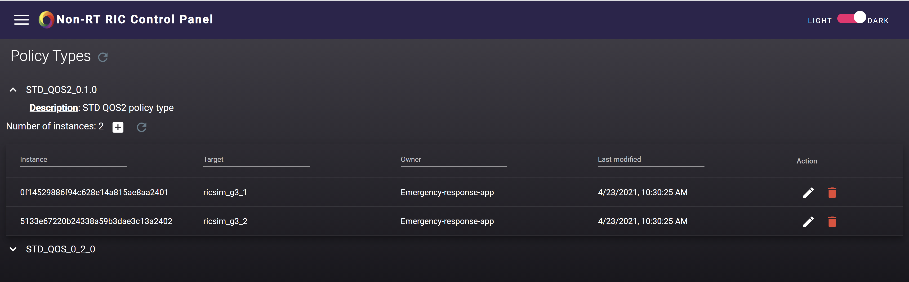

.. This work is licensed under a Creative Commons Attribution 4.0 International License.
.. SPDX-License-Identifier: CC-BY-4.0
.. Copyright (C) 2021 Nordix

Developer Guide
===============

This document provides a quick start for developers of the Non-RT RIC Control Panel.

The Non-RT RIC Control Panel is an interface that allows human users to create, edit and delete policy instances, for
each existing policy type. The policy types and their definitions are retrieved from each Near-RT RIC. 

Additionally, producers and jobs for the Information coordinator service can be viewed.

See the README.md file in the nonrtric-controlpanel repo for information about how to use it.

Start the Control Panel for development
---------------------------------------

To run the Control Panel locally for development, follow the steps below.

First, fetch the latest code from `gerrit <https://gerrit.o-ran-sc.org/r/admin/repos/portal/nonrtric-controlpanel>`_ and
go in to the frontend folder in the repo:

    +----------------------------------------------------+
    | cd nonrtric-controlpanel/webapp-frontend           |
    +----------------------------------------------------+

The Control Panel can be started with mock data to make it easy to develop the GUI without the need to start all services.
Run the following command to start with mock data:

  +------------------------------+
  | npm run start:mock           |
  +------------------------------+

Open the URL:  `localhost:4200`_ in a browser to access the Control Panel with mock information.

    .. _localhost:4200: http://localhost:4200

To start the frontend to get real information from Non-RT RIC services the following services need to be started first:

-  ControlPanel API Gateway
-  Policy Management Service,
-  EI Service.

By pulling the `nonrtric <https://gerrit.o-ran-sc.org/r/admin/repos/nonrtric>`__ repo and using the script
"PM_EI_DEMO.sh" in the folder "test/autotest", the above services will be started and populated with data. It requires
Docker to run. To run this script with a local version of the Control Panel, a docker image of the Control Panel must
first be created. To do this, run the following command:

  +-------------------------------------------------------------------+
  | docker build -t o-ran-sc/nonrtric-controlpanel:2.2.0-SNAPSHOT .   |
  +-------------------------------------------------------------------+

Then run the following command to start the script with the local image:

  +-------------------------------------------------------------------------------------------------------------------+
  | sudo ./PM_EI_DEMO.sh remote-remove docker  --env-file ../common/test_env-oran-d-release.sh --use-local-image CP   |
  +-------------------------------------------------------------------------------------------------------------------+

When the above servers are started and populated with data, run the following command:

   +---------------------+
   | npm start           |
   +---------------------+

Open the URL:  `localhost:8080`_ in a browser to access the Control Panel with real information.

    .. _localhost:8080: http://localhost:8080

From the main page, click on the "Policy Control" card or use the menu on the left hand side of the page. From here, it
is possible to create or list instances for each existing policy type.

When the instances are listed, it is possible to edit or delete each instance from the expanded view.

From the menu on the left hand side, select "Policy -> RIC Config".

From the main page, click on the "Enrichment information coordinator" card or use the menu on the left hand side of the page.
From here it is possible to view producers and jobs from the Information service,

End-to-end call
---------------

In order to make a complete end-to-end call, follow the instructions given in this `guide`_.

.. _guide: https://wiki.o-ran-sc.org/display/RICNR/Testing+End+to+End+call+in+Release+E
