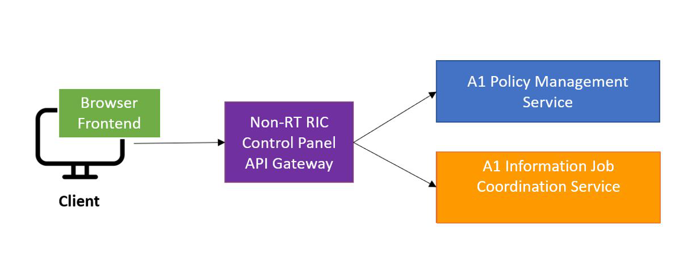

.. This work is licensed under a Creative Commons Attribution 4.0 International License.
.. SPDX-License-Identifier: CC-BY-4.0
.. Copyright (C) 2020 Nordix

Non-RT RIC Control Panel Overview
=================================

The Non-RT RIC Control Panel is a graphical user interface that enables the user to manage A1 Policies in the
network and also view producers and jobs for the Enrichement coordinator service.

The Control Panel generates its GUI for policy editing from the plöoicy type's JSON schemas in a model driven fashion.

The Control Panel consists of a frontend and a gateway. The frontend is developed using the Angular framework.
The Gateway is a Spring Cloud Gateway that provides an API Gateway for all the Non-RT-RIC Components.

.. note::
   It is fully supported in Firefox and Chrome. Minor issues in Safari.
   Not supported in Microsoft Edge and IE.

Control Panel architecture
--------------------------

The architecture of the Control Panel is as shown on the following picture:

The Control Panel  can be deployed following the instructions in the README.md file in the repo.