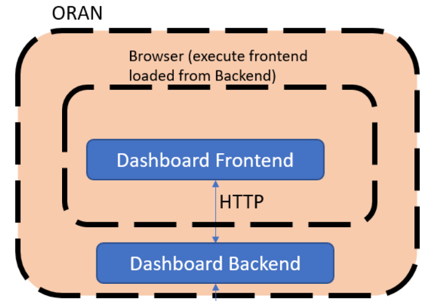

.. This work is licensed under a Creative Commons Attribution 4.0 International License.
.. SPDX-License-Identifier: CC-BY-4.0

Controlpanel Overview
=====================

The Non-RT RIC Controlpanel is a graphical user  user interface that enables the user to manage the Policies in the
network. The Controlpanel interacts with the Policy agent via a REST API.
The Controlpanel generates its GUI from JSON schemas in a model driven fashion.

The Controlpanel consists of a back end implemented as a Java Spring Boot application and a fronted developed using the
Angular framework.

Controlpanel architecture
-------------------------

The architecture of the Controlpanel is as shown on the following picture:

The Controlpanel itself is split into the backend and the frontend, and can be deployed following the instructions in
the README.md file in the repo.