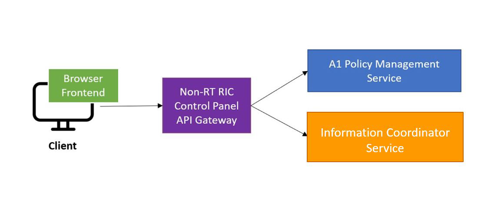

.. This work is licensed under a Creative Commons Attribution 4.0 International License.
.. SPDX-License-Identifier: CC-BY-4.0
.. Copyright (C) 2021 Nordix

Non-RT RIC Control Panel Overview
=================================

Graphical user interface with the following capabilities:

*  View and Manage A1 policies in the RAN (near-RT-RICs)
*  Graphical A1 policy creation/editing is model-driven, based on policy type’s JSON schema
*  View producers and jobs for the Information coordinator service
*  Configure A1 Policy Management Service (add/remove near-rt-rics)

The Control Panel frontend interacts with the A1 Policy Management Service and A1 Information Coordinator
(REST NBIs) via a service exposure gateway, the Nonrtric Gateway. The frontend is developed using the Angular framework.
The Gateway is a Spring Cloud Gateway that provides an API Gateway for all the Non-RT-RIC Components.

.. note::
   It is fully supported in Firefox and Chrome. Minor issues in Safari.
   Not supported in Microsoft Edge and IE.

Control Panel architecture
--------------------------

The architecture of the Control Panel is as shown on the following picture:

The Control Panel can be deployed following the instructions in the Installation Guide.

This product is a part of :doc:`NONRTRIC <nonrtric:index>`.
